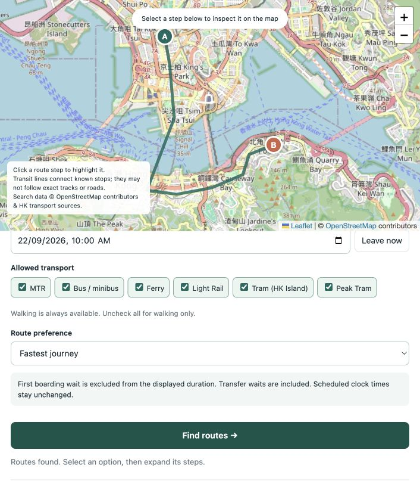
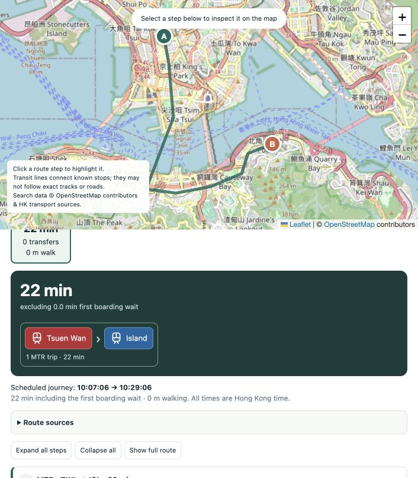
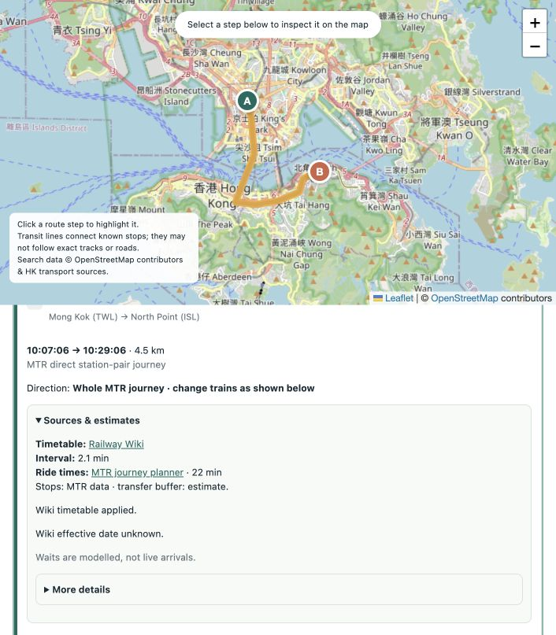

<div align="center">

# HK Route Check

**Explore a route. Inspect the timing. Follow the source.**

Hong Kong public transport · Python + HTML · OpenTripPlanner

[Quick start](#quick-start) · [Cached setup](#use-a-source-cache) · [How it works](docs/SETUP.md) · [Data sources](DATA_SOURCES.md) · [LandsD additions](docs/LANDSD.md)

**Research preview — two-point routing + small worker schedules.**  
Multi-stop mode supports 1–100 jobs; this is not a production journey planner.

</div>

<table>
<tr><th>Choose transport</th><th>Follow the journey</th><th>Check the source</th></tr>
<tr>
<td width="33%"><a href="docs/screenshots/01-route.png"></a></td>
<td width="33%"><a href="docs/screenshots/02-journey.png"></a></td>
<td width="33%"><a href="docs/screenshots/03-sources.png"></a></td>
</tr>
</table>

<sub>Real checker screenshots · Mong Kok → North Point · September 2026 cached data. Click to enlarge.</sub>

### What you can try

- Plan 1–100 jobs at **http://127.0.0.1:8000/multi**, with worker shifts, breaks, per-job work times, live progress and checked routes. Choose **Fast** or **Full pair search** for up to 20 jobs, or **More jobs** for up to 100; the first fast run prepares a cached network. [API and timings](docs/MULTI_STOP.md).
- Search places or pick two points on the map; leave now or choose a departure time.
- Compare up to **6 distinct routes**, ranked together with no transport quota. All six can be MTR via different stations. Choose earliest arrival, fewer transfers, or less walking; turn off **Show alternatives** for a quicker search. [Two-point API](docs/TWO_POINT_API.md).
- Select MTR, buses/minibuses, ferries, Light Rail, Hong Kong Island trams, or funicular where the source feed supports them.
- Follow an icon journey flow, highlight individual steps, and inspect timetable and ride-time sources.

## Quick start

**Prerequisites:** Python **3.11+**, Java **25**, `curl`, macOS/Linux or **Windows via WSL2**. Allow **16 GB RAM and 12 GB free disk** for the full build. Check `python3 --version` and `java -version`. [Installation notes](docs/SETUP.md#prerequisites).

Download or clone this repository, open a terminal in its folder, and run:

```sh
python3 run.py
```

The script installs Python dependencies into `.venv` when needed, downloads the pinned routing tools, collects sources, builds and validates GTFS, builds the map graph, and starts the checker.

Open **http://127.0.0.1:8000** when the terminal says it is ready. **Ctrl+C** stops the checker and its OTP process. Run the same command next time to start the verified existing build.

**First run is substantial:** about 14,656 rail-pair requests, roughly 1,900 selected bus/minibus wiki articles, and five indoor-map layers for each of 98 MTR stations in the tested snapshot. Allow hours for a fresh collection; site delays and retries vary. Downloads and completed build stages are resumable. No API key is needed.

## Use a source cache

If you have a source-cache archive exported by this project, use it with the **same workflow**:

```sh
python3 run.py --cache /path/to/hk-routing-source-cache.tar.gz
```

The archive contains raw source evidence, not a prebuilt GTFS or graph. Checksums are verified before import. Cached pages are reparsed, unmatched/unsupported schedules are excluded, and the feed is rebuilt and validated. Missing source records are fetched unless `--offline` is set. Java and Python dependencies still need to be installed/downloaded once.

Cache snapshots are historical. To reproduce the September 2026 example, use `--start-date 2026-09-22`. A newer date must be supported by the downloaded government calendar. **No cache is bundled in Git or currently hosted by this repository.** [Export, offline setup and refresh](docs/SETUP.md#cache-and-refresh).

| Task | Command |
| --- | --- |
| Build without starting servers | `python3 run.py build` |
| See scraper/build progress | `python3 run.py status` |
| Verify the built feed and graph | `python3 run.py check` |
| Fetch current sources and rebuild | `python3 run.py build --refresh` |
| Export reusable source responses | `python3 run.py export-cache` |

## Rebuild after updating the code

Stop the running app with **Ctrl+C**, then run:

```sh
python3 run.py build
python3 run.py check
python3 run.py
```

`build` reparses cached evidence with the latest builders, validates GTFS and rebuilds OTP. It includes the MTR non-peak change at Tseung Kwan O and LandsD enrichment. Missing sources are fetched. For the existing historical snapshot, use `python3 run.py build --offline --start-date 2026-09-17 --days 30` instead of the first command. [Rebuild details](docs/SETUP.md#rebuild-and-test).

## Know what the numbers mean

MTR uses cached **whole station-pair journey estimates**, including the API's internal line changes. One continuous MTR journey counts as one trip; its line changes remain visible. It is encoded as virtual GTFS connections for this checker, not a claim that one physical train runs the entire journey.

The displayed total runs **from your requested departure to arrival**, including the first wait and any time before leaving. Published headways are **intervals, not live arrivals**. Sun Ferry departures/classes use its current passenger timetable, with the upper end of its published journey-time range. Bus intermediate times, walking, some Light Rail timings and transfer buffers remain estimates. A valid GTFS does not prove real-world timing accuracy. [Verified changes and limits](docs/ROUTING_ACCURACY.md).

**Multi-stop mode:** R5/OTP + OR-Tools searches for fewer workers, then checks actual-departure journeys. It includes all waits when checking shifts. If it cannot validate a schedule within the budget, it reports that explicitly. The More jobs mode uses R5 + OR-Tools Routing for up to 100 jobs; larger lists are not supported yet. [Details](docs/LARGE_MODE.md).

Code: [MIT](LICENSE). Data and map credits: [DATA_SOURCES.md](DATA_SOURCES.md). [Contributing and tests](CONTRIBUTING.md).
